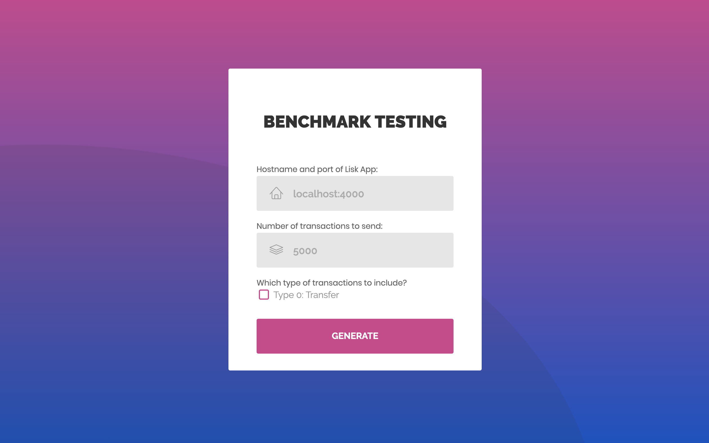

# Lisk Benchmark UI (WIP)
Side project to create a UI for a basic benchmarking script created by @pablitovicente
The UI expects you to input the amount of tx you want to send and the `hostname:port` of your Lisk app.
It will prepare and download a script for you with the given parameters which you can simply run with `node`.

## Improvements
- Log results when benchmarking is completed (`/api/node/status` or calculate)
- Add the possibility to send a mix of transactions instead of only `transfer` transactions.

## Current UI

## Source
Source UI template: https://colorlib.com/wp/template/login-form-v11/
